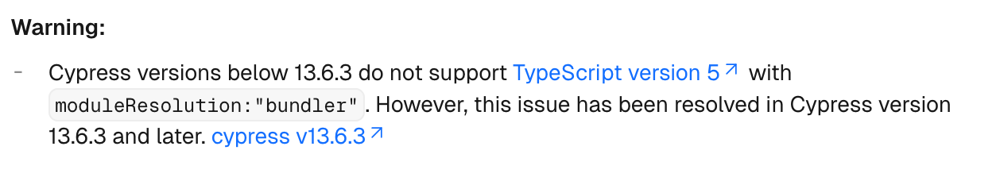
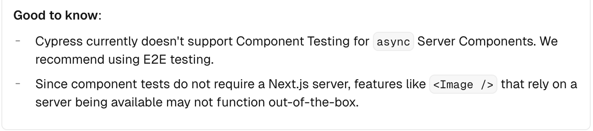

# Cypress Integration

Next.js  has a warning that i should remember for later. It involves Typescript 5 and cypress versions less than 13.16.3.

## E2E Testing
- only use e2e testing because cypress can't handle async promises to  server yet
- run e2e tests with
- `npm run e2e`
  - for now, ignore "preparecypress", "e2e:headless", and "test" in  package.json

